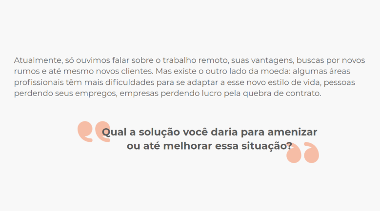
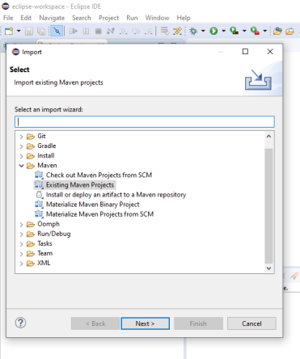
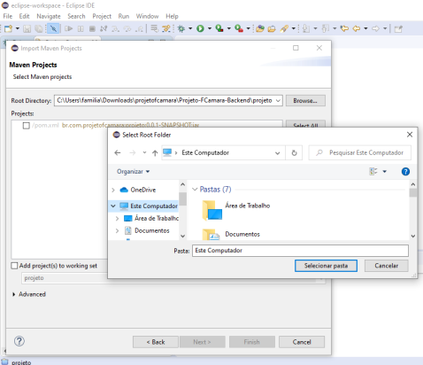
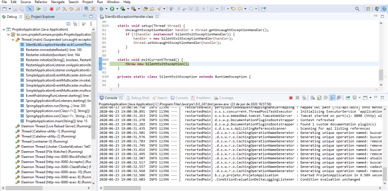

# Projeto FCamara

Repositorio para o backend do projeto da SQUAD 10 para o programa de formação FCamara 2020. [Link para o frontend](https://github.com/MatheusPalinkas/Projeto-FCamara-Frontend)

Integrantes: [Matheus Palinkas](https://www.linkedin.com/in/matheus-palinkas/), 
             [Adriana Penha](https://www.linkedin.com/in/adriana-penha-598b12124/), 
             [Gusthavo Rodrigues](https://www.linkedin.com/in/gusthavo-rodrigues-487847197/)

---

# Case 



---

# Nossa proposta de solução

Criar um Site/App (Responsivo), para poder ser um meio dos pequenos comércios (a maioria sem CNPJ) afetados pela pandemia, poder alcançar e vender os seus produtos (através da internet), para os seus clientes e possíveis consumidores.

---

# Pré-requisitos

- Java instalado na sua maquina (esse projeto utiliza a versão 8)
  - [Link para download](https://www.java.com/pt_BR/download/help/download_options.xml)
- MongoDB instalado na sua maquina ou uma versão remota (esse projeto utiliza a versão 4.2)
  - [Link para download](https://docs.mongodb.com/manual/administration/install-community/)
- Uma IDE para executar o projeto
  - [Eclipse (esse projeto usa o eclipse na versão 4.15)](https://www.eclipse.org/downloads/packages/)
  - [IntelliJ IDEA](https://www.jetbrains.com/pt-br/idea/)
  - [Spring Tools](https://spring.io/tools)

---

# Passo a passo

### 1. clonar o repositório

```git clone https://github.com/MatheusPalinkas/Projeto-FCamara-Backend.git```

### 2. importar o projeto na IDE (exemplo no eclipse)

2.1. Clicar no menu File > import
2.2. Existing Maven Projects e clicar em next



2.3. Procurar a pasta e importar pom.xml



2.4. Esperar o download das dependencias do maven

### 3 configurar application.propertes

3.1 Mudar o nome do arquivo application.example.properties para application.properties
3.2 colocar um valor como chave para o *projeto.jwt.secret*
3.3 configurar sua conexão com o mongoDB

### 4 iniciar aplicação

Iniciar a o projeto clicando no botão de *Debug*



---

## Outros links

[](https://insomnia.rest/run/?label=ProjetoFCamara&uri=https%3A%2F%2Fraw.githubusercontent.com%2FMatheusPalinkas%2FProjeto-FCamara-Backend%2FDEV%2Fdocs%2Fdoc-rotas-insomnia.json)

[Link para arquivos no drive](https://drive.google.com/drive/folders/17vXJTFi-uhJ_oOf2tmRV0r_MPpUXcZnn?usp=sharing)

[Link para modelo do banco de dados](https://app.diagrams.net/?lightbox=1&highlight=0000ff&edit=_blank&layers=1&nav=1&title=Untitled%20Diagram.drawio#R7Z1bc9o6EMc%2FTR6T8R14DJD0RnNokjan54VRsAqeGovaJgn99EcGC7AliAnyRe1mOh0sjGzLf%2F%2B0u1rJZ2Zv9vIuRPPpZ%2BJi%2F8zQ3Jczs39mGG2nTf9PCpbrAss01wWT0HPXRfq24M77jdNCLS1deC6OMjvGhPixN88WjkkQ4HGcKUNhSJ6zu%2F0gfvaoczTBXMHdGPl86YPnxtP0sozWtvw99iZTdmTd6ay%2FmSG2c3ol0RS55HmnyLw6M3shIfH60%2Bylh%2F2k7Vi7PHxYPviDn867j1%2BiX%2Bhr99P9zbfzdWXXx%2FxkcwkhDuI3V91p%2Fep%2FaznPg%2B9BT6e%2F%2FBkN3XN2M5%2BQv0gbLL3YeMlaELu0QdNNegJevLzFPoo9Elxtv%2Bn%2BIEGc3n2dNk13Gs%2F85DP9iAP3MrmTdPPq9jcOyT35jAKqp24UozDOf%2FdPkNRX8JrTtonIIhyn5zsef%2FgW%2FhxYoX%2F5fvTbpBf65dO5zbSHwgmOD%2BxopS2SXPWOgtI2fYfJDMfhku7wvFWTrqUSme4qiRWGq9Z6yuoRpbKebCrcHGNIPHrJhsaeQDutZ8nqNbVsHeuLT3%2B2q4BcTbrZbl3oRqY2p6VdGFars%2FnLVr1uLq5q%2BmGnLbZFK8kdIz%2B7avnNUOCuBZbT3vaLupTXshumPF2ztLxY3qg83czW1M7XVLbQnD9faI5TVGh6w4TWaRkXbW37l0WU5bTpt1tCdey3ibDVyqnZrlaDlv6X9LVtgxci6f7%2Bz%2Bqcf%2FKeh9dX%2F2kfv7yQwbluNUyITivf176VeI6WA55Rbc9q%2Fy2GXato98pMm8aIzW7ZF9YO9fQsnTr6hc2MtWPVZzlZ9VnldbfirohH3TcqFuySkFNh9OzNfBRspJZ%2Bk%2BhrPPV8d4CWZJE0PdXU%2BCfb6k5J6P2m%2ByMmxpXkUqEaTmaPu%2BSXtFijpSGO6D5DJj89V%2FQZvWR2HKAoTgvGxPfRPPIeN%2Bc3o63oBV0Sx2SW7oR8bxLQz2NaFw5zj491tPyfcBjjl4NyZX2okb3lRit13Hfl7AjkbFjaq8q9pZ45Cib0wneciZxxqLPtnQMKj%2BdkD4d82lABinGXLAI3KkWOBifHD31eiFM0Tz7SexN7yN9es9mNyTy9vz7%2BwfQQpteUfH5kGtB3NLDet5vcQ2%2BM%2FMu0eOa57pqsnu%2F3iE%2BfCbMfkLWtOEdjL5gM1kcxrW3RbXq0pIjQKn%2F4K7ZOaWU4SM6GxChGa20mZzRPnu1VE9td%2Bo%2FeiJ52YZ%2FZ9Ep7dFvfbtN%2Fye5h3CNBFIfIWwkTU%2BE%2F40T8XTck83uGVy33nNqCLoLX%2BGFKvC7yZVY7r2k67yHvSjojrqOVxHerw08nK%2BlxlyACVRQVVFY90sTzmj6Sy0yl%2F1YlGHuUsIkLpid3tht629drm5UqgvcsP%2FRHPVp7OPZIOZDRXtfEqjLFCVMFUeyCRNHbVlkCanECuq4dKWv5qMsTZ48OpPGkPD1YHU4PnBrq8dzwixf%2Fyyqgn78nd%2FfCTrf6zHBebSzTjePM3V1vT%2BzWprGf18P4TYtx6XbOJzP1XESgcDDVyY0IWEa1gSzb4hT6NVqgMOnutJ7vJa4PDzBw82S4eTrtnS7srOPFAPGqp5cPJyjt6R3kA3h6dXl6h4nRSE9PfMq8XQ%2Be3lGW2eEHtNGenvjUeUP9hlZdDl3AxZOGkqIuXr67kiec9usWPfh3R4mgtUcE0ihSnhh49%2B5qhjwfMNJwjLBR7dowwg4GGJGGkc4eETQKI%2BJhb04LdziYIqBIwymia0WHZctSDhgjkoPNStgi4pQYTgp92pKjGxSNvRm9aBi%2BajxOTKtmnOhglUjmibpGic6nffWG1wCRpkPE4eP5FUPEAIjIhYi%2Bb2RJAYrwOVb3mN6l5LYBSqSgZHdYRyuPK%2B0KI69iKfEj1cCV07hi7lFBo7ginm3SqPk3pU0DKzz7Jg0ENCZDxmauRIqPlp4bySs89yZXkZOvqOTZDyYfYrkKXBziMYlGd8h%2FIhFPIUiPkZIeY%2BXmXZlFbduNJ%2F1HJMeIdcnHeyA5pv5pEBtcNDI5RpxdyQd9IDnmdOPKLD30U54ieOPqQ3%2F0NaL0B5%2BtyikQx9OkyvwYsXb46A%2FMgDgRJZa68R%2BLj%2F9QlDALGnDScJxUmScj1g8f9AGcnIoTJcI%2B4lPnpwRA2q4CHKk%2FU8YqsGgUYOQojJSe%2FV9ewh3v8u6f5A3BPBnBvM0inSyOy6ZK7xKhLfJy8yt7%2FXmxvJbI3y6nT4NYXnHAbShxUixPqOmyIjct3vuGWJ6ErNDSHfDyFCGaRAsOeD2G8%2FFEEcXzREQpz1Ti7WZwwE%2FFiRKW88FVPnMrJFHzaELNWZiy0nSeiAJ6ZfFELCC%2BPwKeFOfJ4Yey0TwRK5hPY4CAngIcEQb0KjVM2nwMBzBymlmixGQVIQHZvd8Rw4DQOzO6jHHgwvw3NZgimv9WqXFiFFhoHZhyjGmyeTAVZAqnhfckTBbGG10%2B0qtZhODtNJ4oooThSokCQJENFGV5IpgXyYByjcdTBEaKEkgRzYOrNoICTJEdP1EXKoZg%2Bd7bweiaAEoaj5LNEr71%2BTsFXtkIKDnKPFEiFCs2VcUoufNEC4ADSpqFErPCcKxYPYASySgxFUYJnzSwskrQGD8S8hNw0nScOHVHYk1%2BTUzAyWk4Kf01OuWJgY%2BcDEkULbzRHQ6fvCSNTRtdBXGIJ0iwGgPApVlw6RQMyrLgrXw9QQRFNlxKj6DYnYvO7l%2B7rLyCjuBdISFxF6KACkwNkTE1xMy9TMsRzNT4C96BJFYjbwfB1JD6p4Z09hlTR00NqXSZlw6%2FkBVMDZGwwG%2FpK4aXpwjRElLwttt67OjjiVL7Ui%2BbtQIhl1siT9RNwuQ7GJgaohBPqlzrRagfvjsCmpzol%2B9bqKNRMNnTufCT4mFmiAIYqX%2BpF13j48XAkdNWCtf2RXVUIAkf7h3C5HcVUNKAFyLBSweko0SJ5eeE5hQvhj6OxiG9OwCTxsOkyhcjCdUDGVKSvRt1E6T25EdB1rYCHKnyRUhC8UBqlGSOKJwZJXg7TRSTXwtBnASSFWQkK9gse4m9k0YraFbohzJWlEtWEKsR3klTc7LCYUg0MllBbNnxI4uQrCAhTU%2BJd9KIFSF8J83ezDwwmuUYzZKAUmWuglg%2B%2FJAADC6e6n4rMSYgPnU%2BFvMldkd9L5qTwHvCPhCl4USpPVsBXighnSfqLotr8TGZhCffksXnXEh9ajpMKs1ZEAuID%2BQATU6jSemJ2eUNFPFiSGgyxG4S7QKaNJ0mVaYtiAXEB%2BKAJifRxFYik1J86nzk5HKMHskCQNJ0kNSfssCHTQAkp4FEiaCJeMV1HiQHZnfAcGMZw42dokjYuDR%2FxHCjWI88nGC4sf650e3iIm%2FK3Oi2IEO89tEBpYYbDz%2BgjR5uFJ86n%2BoLs48qz847HiW1T4puQ5avbIookeYrPnV%2BjAgmDKiCkipHGMWnDIm%2BslGibqavXaBfwe4EMwOeNoQXL2%2Bxj2KPBFfbb7i2m8Yz5mzjwL0Mw9U9u7qdocD9Zw2GxAcXfYFfvPhf9lv6%2BXtyXy%2FsdKvPfO7VxjLd4G%2FVIU85IotwjA%2FcUrb%2BTswYsa8BWe5b0kgHH%2F%2Fd510TetZpYbhq3Cec0dEBd3uYqH3rarfbWU%2FbtnLG7Pra019t5cNV1MlVZOUrWrcNV5EsP9zmkzX3v18awkIywkK67uiZe%2B50zIK9VeeAy%2FRnxIUEAx4QF6o%2FLrTBhDpxIcHwB8SFTjfDyh8DKU8RfKSwdzUsBy7gy0kjSe1hIRvWkZANESWWkRCfOu%2FLDagnES9cCDA3nSS1R4VsyDuXTRIl8s7Fp86HCAckmABKVEBJ%2FSvlCRKNgSWnsUTdrHOD71h6nosAJM0HSe0J5wYMVcl%2BkagSQ1ViAfOzDwZkEiKXLEIY9m48TKpMOheeMzsYwESaVaLuSwV03iq5WcwwgKT5IKl9oTwdrBLJVomuhFUiPnXe1%2B0iLwSQNB4km9f81QcSmE8rGyTqzqc1ePP06zVApOkQMete4sPg05IAIqfFSPapoPkQMXmI9Mhs7uMZvWQwSRpPE6fuiKsJNJG9OKoSNHlwNKe%2FvO%2Bjh4fu4%2FLX5fM%2F4ZdzAUxuhh%2BBImVRRE4Sd5uNmrC5%2FWzCz6tQMUvSETDl7Uw5%2BGCWh5SypGBwUoD5z81HSoeZxOztBFUO5gh1xOdLA1JOQoqxRxPNt1L4FOirGfJgqWXVmFLluI5QSLDEgmSmKLHCgvDM%2BdHhOxxMYcVlxZhiVTnEIxQSDBVLZooSI8XCM%2BcHivu0JUc3KBp7EJ5VkS5Vjv0IJQXjx5LposTwsTjGJgjWDmH8WDWk1B5Y0SFYK5kpevnR2tLEwIdr7zG9S8ltA7JIIcvuKihaZZipPdaiQwBXNmaaGMGlmyEh8e5CTCGaTz8TFyd7%2FA8%3D)
